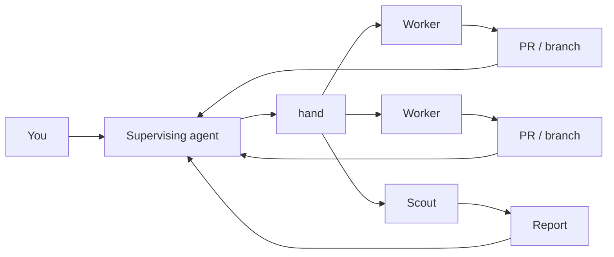
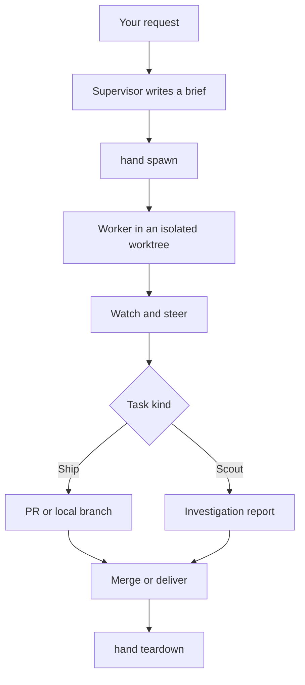
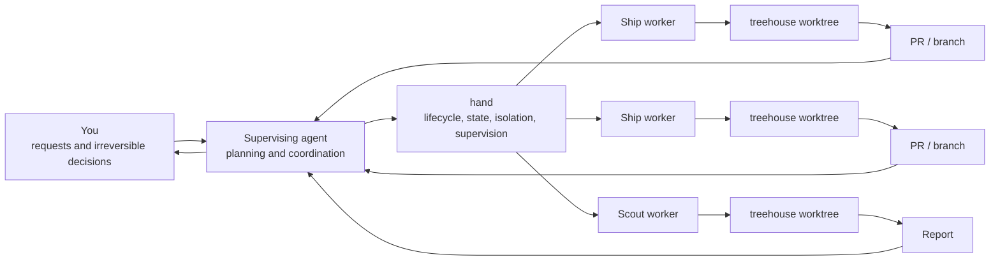

# Secondhand

**You lead. `hand` runs the crew.**

Secondhand turns one coding-agent session into a supervisor for a fleet of coding agents.

You talk to one agent. It plans the work, writes briefs, dispatches workers into isolated git worktrees, watches them, steers them when needed, and brings the results back to you.

`hand` is the CLI underneath that workflow. It owns lifecycle, state, isolation, and process supervision so the supervising agent can focus on judgment and coordination.



Secondhand was inspired by [firstmate](https://github.com/kunchenguid/firstmate), rebuilding the same agent-fleet idea as a focused Go CLI.

## Why Secondhand?

Coding agents are good at working on a task. Running several of them reliably is a different problem.

Someone still has to:

- give each worker enough context
- keep concurrent work isolated
- know which worker is running, blocked, or done
- steer a worker without restarting it
- preserve task state across supervising sessions
- decide when work is ready to merge or hand off
- clean up worktrees and processes without losing unfinished work

Secondhand splits those responsibilities cleanly: **the supervisor handles judgment; `hand` handles mechanics.**

## Quick start

### 1. Install `hand`

From a release:

```sh
curl -fsSLO https://github.com/atqamz/hand/releases/latest/download/hand-linux-amd64.tar.gz
tar xzf hand-linux-amd64.tar.gz
install -m755 hand ~/.local/bin/hand
```

Or with Nix:

```sh
nix profile install github:atqamz/hand
```

See [Installation](#installation) for every supported option.

### 2. Create a fleet home

A fleet home is the directory where the supervising agent lives and where Secondhand keeps fleet state.

```sh
mkdir ~/fleet
cd ~/fleet
hand init
```

`hand init` is non-interactive. It creates the fleet structure and writes a managed block into `AGENTS.md` telling any supervising harness to run `hand session start` before acting, with a `CLAUDE.md` reference when that name is otherwise absent. This is a symlink on Unix and an `@AGENTS.md` pointer file on Windows.

### 3. Add a project

```sh
hand project add https://github.com/you/project
```

Secondhand clones the repository under the fleet home and prepares it for isolated worker worktrees.

### 4. Open a supervising session

For Claude Code:

```sh
cd ~/fleet
claude
```

The generated `AGENTS.md` block tells the harness to run `hand session start` before responding or acting; that command loads bounded fleet context and reports the first next action, and refuses outright inside a worker's isolated worktree. Any other supported harness reads the same instructions from `AGENTS.md` directly.

On the first session, the supervisor may ask which worker harness, model, or effort level you want. Your answers are persisted with `hand config`; nothing is guessed on your behalf.

### 5. Give it work

Talk to the supervisor normally:

> Fix the login regression. Also investigate why the integration tests are flaky, but do not change anything for that investigation yet.

The supervisor can dispatch the fix as a **ship task** and the investigation as a **scout task**, then coordinate both while you keep talking to one agent.

## How it works



### Ship tasks

Ship tasks make changes. A worker receives its own git worktree, works independently, and produces a pull request or local branch according to the project's delivery mode.

### Scout tasks

Scout tasks investigate without being expected to ship code. They return `data/<id>/report.md`, and a completed scout can later be promoted into a ship task.

## What `hand` manages

### Isolated workers

Every worker operates in a git worktree leased through [treehouse](https://github.com/kunchenguid/treehouse). Workers never edit the registered project clone directly.

### Live supervision

Workers run interactively inside [herdr](https://github.com/ogulcancelik/herdr), so the supervisor can observe semantic agent state, send follow-up instructions with `hand send`, and react to fleet events with `hand watch` without scraping a terminal for meaning.

### Durable fleet state

Machine state lives in SQLite while operator context, briefs, reports, backlog history, and learnings remain plain files. The fleet survives the supervising agent's session, so a later session can pick up where the previous one stopped.

### Safe lifecycle boundaries

`hand` fails closed around destructive or irreversible transitions. Teardown refuses unlanded work unless it was explicitly delivered, and the generated supervisor rules prohibit merging without operator authorization.

### Agent-first output

`hand` is designed primarily for agent callers rather than as a terminal dashboard. Commands return compact structured TOON documents with named fields, aggregates, machine-readable states, and suggested next actions. Read commands that support it retain `--json` as an alternative.

## Project delivery modes

Each registered project has a delivery mode:

| Mode | Workflow |
| --- | --- |
| `direct-pr` | Workers produce normal branches and pull requests. This is the default. |
| `no-mistakes` | Delivery is guarded by a [no-mistakes](https://github.com/yes2games/no-mistakes) validation pipeline. |
| `local-only` | Work stays local instead of using a remote pull-request workflow. |

Choose a mode when registering a project:

```sh
hand project add https://github.com/you/project --mode direct-pr
```

For a fork, declare the upstream repository that receives pull requests:

```sh
hand project upstream project-name upstream-owner/project
```

If the repository is renamed or transferred, repoint the registered project without changing its local identity:

```sh
hand project set-url project-name https://github.com/you/renamed-project.git
```

This keeps the project name and `projects/<name>` clone path stable, updates both the registry URL and clone `origin`, and preserves tasks and completion history.
`hand project sync` can also repair a recognized GitHub rename when GitHub reports the canonical repository.

## Worker harnesses

Secondhand can launch workers through:

- Claude Code (`claude`)
- Codex (`codex`)
- Grok (`grok`)
- Pi (`pi`)
- OpenCode (`opencode`)

Without an override, workers inherit the harness detected as the current supervisor; only when none can be detected does `hand config` report the harness as `missing`. Inspect and configure fleet defaults with:

```sh
hand config
hand config set harness claude
hand config set model claude-opus-5
```

Model and effort support depends on the harness: `hand config` reports each as `native-default`, `configured`, or `unsupported` instead of silently storing a setting a harness cannot carry. Overrides are stored per harness, so switching harnesses never hands a worker a model or effort chosen for a different tool.

A task brief can also declare model and effort for that specific worker; explicit spawn or promote flags win over brief values, which win over these defaults.

## Fleet home

A fleet home is deliberately separate from the repositories being worked on.

```text
~/fleet/
├── AGENTS.md
├── CLAUDE.md
├── config/
├── data/
│   ├── backlog.md
│   ├── operator.md
│   ├── learnings.md
│   └── ...
├── projects/
└── state/
```

The important pieces are:

- `AGENTS.md` - operating instructions for the supervising agent
- `data/operator.md` - your standing constraints and preferences
- `data/backlog.md` - the supervisor's task queue
- `data/learnings.md` - durable operational knowledge discovered by the fleet
- `projects/` - registered project clones
- `state/hand.db` - authoritative machine state

You normally do not manage these by hand. The supervisor and `hand` own the workflow.

Every command resolves the fleet home from `HAND_HOME` when set, otherwise from the current directory or the nearest ancestor containing `state/hand.db`.

## Requirements

`hand` itself is a self-contained Go binary. Operating a fleet relies on a few external tools:

- [herdr](https://github.com/ogulcancelik/herdr) - interactive worker sessions and semantic agent state
- [treehouse](https://github.com/kunchenguid/treehouse) v2.1.0 or newer - isolated git worktree pools
- [gh](https://github.com/cli/cli) - GitHub pull-request and release operations
- at least one supported coding-agent harness

Optional:

- `sh` - a POSIX-compatible shell, required when a non-empty `config/notify` is configured, including on Windows
- [no-mistakes](https://github.com/yes2games/no-mistakes) - required only by projects using `no-mistakes` mode
- [qmd](https://github.com/tobi/qmd) - semantic search over historical fleet context beyond `hand search`

`hand init` reports checked tools it cannot find on `PATH`. `hand doctor` checks the fleet home's generated agent instructions and related drift.

Building from source additionally requires Go 1.26.5 or newer.

## Installation

### Release binary

Release tar archives are available for Linux and macOS on AMD64 and ARM64. A ZIP archive is available for Windows AMD64. Every release includes `checksums.txt`.

```sh
curl -fsSLO https://github.com/atqamz/hand/releases/latest/download/hand-linux-amd64.tar.gz
tar xzf hand-linux-amd64.tar.gz
install -m755 hand ~/.local/bin/hand
```

On Windows, download `hand-windows-amd64.zip`, extract `hand.exe`, and place it on `PATH`.

See the [releases page](https://github.com/atqamz/hand/releases) for every asset.

### Edge builds

Edge is a rolling GitHub prerelease for maintainers and contributors who want the newest CI-verified `main` build.
It is intentionally mutable and may contain unreleased behavior or state/schema changes.
Stable users should continue using the normal release assets above.

Install the Linux AMD64 edge asset directly:

```sh
curl -fsSLO https://github.com/atqamz/hand/releases/download/edge/hand-linux-amd64.tar.gz
tar xzf hand-linux-amd64.tar.gz
install -m755 hand ~/.local/bin/hand
```

Opt into edge from an existing installation:

```sh
hand update --channel edge
```

Check for an edge update without installing it:

```sh
hand update --check --channel edge
```

After an edge binary is installed, plain `hand update` continues tracking edge.
Switch back explicitly with `hand update --channel stable`.
That switch is a downgrade from unreleased development state, so it may not be runtime-compatible with every future migration performed while using edge.

### Nix

Install into your profile:

```sh
nix profile install github:atqamz/hand
```

Or run it without installing:

```sh
nix shell github:atqamz/hand -c hand --version
```

The flake covers `aarch64-darwin`, `aarch64-linux`, and `x86_64-linux`. On Intel macOS, use a release binary or `go install`.

### Go

```sh
go install github.com/atqamz/hand@latest
```

`go install` does not embed release-version metadata, so the binary reports `dev` and never checks for updates. Prefer a release binary or Nix installation for a versioned build.

To build a checkout for contributing to Secondhand itself, see [CONTRIBUTING.md](CONTRIBUTING.md).

## Notifications

Configure notifications by writing a text file at `config/notify`.
The file contains a POSIX shell snippet, and the notification text is available as `$HAND_MESSAGE`.

For every supported operating system, the execution contract is:

```text
config/notify -> POSIX sh -c
```

This applies on Linux, macOS, and Windows.
On Windows, Hand does not reinterpret the template as `cmd.exe` batch syntax, PowerShell, or WSL shell syntax, and it does not invoke `wsl.exe` automatically.
A POSIX-compatible `sh` executable must be directly resolvable from the Windows process's `PATH`.
Git for Windows and MSYS2 are examples of environments that may provide such an executable, but installing WSL alone does not satisfy this requirement.

Literal Windows paths are still part of POSIX shell source.
For example, users should not assume this is safe template source:

```text
C:\some\path\notifier.exe
```

Backslashes have meaning to POSIX shells, so quote or escape literal paths according to POSIX shell rules, or use a shell-compatible representation such as a forward-slash Windows path when supported.
Hand does not rewrite paths or automatically escape arbitrary template source.

## Command map

You normally let the supervising agent drive the CLI. The main lifecycle is:

| Command | Purpose |
| --- | --- |
| `hand init` | Create or refresh a fleet home. |
| `hand project add` | Register a repository with the fleet. |
| `hand project set-url <name> <repo-url>` | Recover a registered project after a repository rename or transfer while preserving its local identity and task history. |
| `hand spawn` | Dispatch a worker into an isolated worktree. |
| `hand status` | Read fleet or task state. |
| `hand watch` | Wait for actionable fleet events. |
| `hand send` | Steer a running worker. |
| `hand merge` | Merge completed work after authorization. |
| `hand deliver` | Mark work as handed off when landing is someone else's decision. |
| `hand teardown` | Clean up a completed task safely. |

Other commands cover session bootstrap, configuration, project sync and upstreams, holds, scout promotion, search, notifications, diagnostics, PR recording, and self-update.

Run `hand --help` for the authoritative command reference.

Running bare `hand` returns the resolved fleet home, worker configuration, and live fleet overview rather than a generic help screen.

## Updating

Release installations can update themselves:

```sh
hand update
```

Check without installing:

```sh
hand update --check
```

Without `--channel`, the installed build determines the target channel.

| Installed build | `hand update` target |
| --- | --- |
| stable | stable |
| edge | edge |
| dev | stable |

Use `--channel stable` or `--channel edge` for an explicit target or channel switch.
The edge channel compares embedded commit identities, while stable compares release SemVer versions.

When run inside a fleet home, an update also refreshes the generated section of `AGENTS.md` without overwriting your own additions. Other commands check for a newer release at most once a day and print a one-line notice when one is available.

## Architecture

Secondhand deliberately separates judgment from mechanics.



The supervisor owns planning and judgment. `hand` owns lifecycle, state, isolation, and supervision. Workers own individual tasks. You remain the authority for irreversible decisions.

For durable architectural rationale, see [`docs/adr/`](docs/adr/). Behavioral command contracts live with their implementation, help, and focused tests.

## Contributing

See [CONTRIBUTING.md](CONTRIBUTING.md).

The short path is:

```sh
git clone https://github.com/atqamz/hand
cd hand
nix develop
make build
make lint
make test
```

Run `make e2e` when changing CLI behavior. Secondhand uses conventional commits and release-please for versioning and changelogs.

## License

[MIT](LICENSE)
