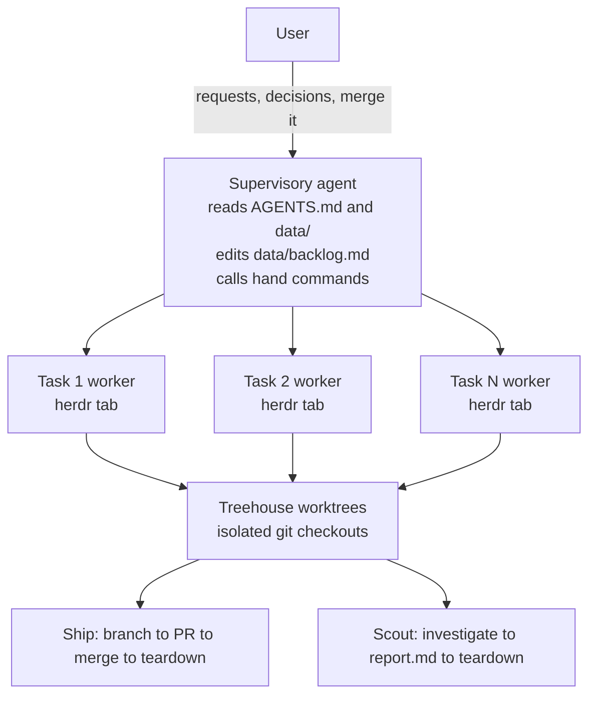

# Secondhand

Talk to one agent. Ship with a crew.

Secondhand is a single Go CLI binary, `hand`, that orchestrates a fleet of coding agents across projects.
A supervisory agent runs in a fleet home - a standalone directory anywhere on disk, or the secondhand checkout itself - records tasks in a markdown backlog, and calls `hand` to spawn autonomous workers into isolated git worktrees.
The CLI owns lifecycle correctness, state management, and process supervision.
It was born from [firstmate](https://github.com/kunchenguid/firstmate), an agent fleet supervisor built as 34K lines of shell, and rebuilds that concept as a clean CLI.

## Quick start

```sh
git clone https://github.com/atqamz/secondhand
cd secondhand
make build
./hand init --setup
./hand project add https://github.com/org/repo
```

The worker lifecycle commands are available, including `hand spawn`, `hand status`, `hand send`, and `hand teardown`.

## Set up a fleet home

The quick start above dogfoods a fleet home inside the secondhand repo checkout itself, which is how the maintainers run it.
Most users instead want a standalone fleet home: a plain directory, anywhere on disk, unrelated to any project's own repo.

```sh
mkdir ~/fleet
cd ~/fleet
hand init --setup
hand project add https://github.com/org/repo
```

`hand init` only writes runtime directories, skeleton files and a `.claude/settings.json` session hook under the current directory; it never places a `hand` binary there.
Install `hand` from one of the options under "Installation" below and make sure it is on `PATH` before running any command.

Every `hand` command resolves its fleet home the same way: the `HAND_HOME` environment variable if set, otherwise the current directory or the nearest ancestor holding `state/hand.db`.
`state/hand.db` is the marker because only `hand` ever writes it, so a project clone under `projects/` carrying its own generic top-level `data/` and `state/` never captures the walk up.
Set `HAND_HOME` to run `hand` from outside the fleet home, for example from a script or a different working directory; pointed at a directory that is not a fleet home it refuses rather than falling back.

## Core concepts

- **Projects**: git repositories cloned under `projects/`, registered in `hand`'s machine state and projected to `data/projects.md`. Each has a delivery mode: `no-mistakes`, `direct-pr`, or `local-only`.
- **Tasks**: units of work identified by a unique ID. Ship tasks produce a branch and PR; scout tasks investigate and produce `data/<id>/report.md`.
- **Briefs**: task instructions at `data/<id>/brief.md`, written by the supervisory agent before spawning a worker.
- **herdr tabs**: each worker runs in its own herdr tab. herdr provides semantic agent state (working/idle/blocked/done/unknown) and push events, so no terminal scraping. herdr's state says whether a pane is busy, not whether a task finished - see SPECS.md's "Agent state" section.
- **Report channel**: `state/<id>.status` is an append-only file the worker writes and `hand` only reads. It carries the task outcome herdr cannot (working/paused/blocked/needs-decision/done/failed), surfaces in `hand status` and `hand watch`, and auto-records a PR URL the worker reports - see SPECS.md's "Report channel" section.
- **treehouse worktrees**: workers operate in isolated git checkouts acquired from a treehouse pool, never in the project clone itself.
- **Backlog**: `data/backlog.md` is a plain markdown task queue, read and edited directly by the supervisory agent. Finished entries roll off into `data/done-archive.md`, dropped ones into `data/note-archive.md`.
- **Operator context and learnings**: `data/operator.md` is written by the operator for the agent to read first - identity, authority, hard constraints - and `data/learnings.md` is the agent's own curated record of operational facts that cost real time to discover. The agent reads `data/operator.md` and never rewrites it, which is what lets its constraints outrank the agent's judgment. `hand init` seeds both, `hand update` seeds whichever an older home is missing, and neither ever overwrites one that exists; nothing under `data/` is maintained by hand for the operator to read, since `hand status` and the issue tracker are their view of the fleet.
- **Ambient context**: `hand init` and `hand update` install `hand` as a Claude Code `SessionStart` hook in the home's `.claude/settings.json`, so a supervising session opens with the fleet overview already in context instead of spending a turn asking for it. The file is merged, never overwritten: an operator's own hooks and permissions survive every refresh, and hand owns at most one entry - see SPECS.md's "Ambient context" section.
- **Machine state vs. the prose corpus**: machine state - tasks, PR state, pane ids, the project registry, holds - is authoritative in sqlite at `state/hand.db`. The prose under `data/` stays authoritative in files, with a derived full-text index at `state/index.db` that `hand search` reads and that is safe to delete at any time. When the database and a `state/<id>.status` file disagree about what a worker said, believe the file: it is readable without a working `hand`, which is what recovery has actually needed - see SPECS.md's "Machine state and the prose corpus" section.

## CLI overview

| Command | Description | Status |
| --- | --- | --- |
| `hand` | With no subcommand: name the binary that answered, its version and the fleet home it resolved, followed by the fleet overview `hand status` prints | Available |
| `hand init` | Initialize runtime directories, skeleton files and the session hook; `--setup` runs interactive first-time configuration | Available |
| `hand project add` | Clone and register a repository | Available |
| `hand project list` | List registered projects | Available |
| `hand project remove` | Unregister a project, keeping its clone | Available |
| `hand project sync` | Fast-forward project clones to their remote default branch | Available |
| `hand project upstream` | Declare the repo a fork project opens its PRs against, so `hand pr` accepts a PR living there and gate-opened-PR detection looks for one there | Available |
| `hand spawn` | Spawn a worker agent in an isolated worktree | Available |
| `hand status` | Show fleet overview or single-task detail | Available |
| `hand send` | Send a message to a running worker, from an argument or `--file`; waits out a busy composer up to `--wait` instead of failing, and records the message as undelivered when it never reaches the pane | Available |
| `hand hold set` | Record that an id is waiting on a human or on another id; survives the task's teardown, so `hand spawn` refuses to reuse a held id | Available |
| `hand hold clear` | Clear the hold on an id | Available |
| `hand watch` | Blocking watcher that prints actionable fleet events, including a worker gone silent with no herdr transition at all (`parked`), and steers a worker whose harness stopped on a usage limit back into its task once the quota plausibly returned, instead of leaving it dead until someone notices; `--until-event` exits on the first one - narrowed to chosen kinds with `--event` - so the exit itself wakes the supervisory agent, and exits `5` naming any worker it can't reach before arming; one watcher per fleet home, so a second exits `3` naming the incumbent unless it passes `--takeover` | Available |
| `hand merge` | Merge a task's completed work | Available |
| `hand pr` | Record a task's pull request URL | Available |
| `hand search` | Full-text search the prose corpus under `data/` | Available |
| `hand doctor` | Report perishable content and generated-block drift in the fleet home's `AGENTS.md`; fixes nothing | Available |
| `hand deliver` | Record that a task's work is handed off and landing it is someone else's decision, so `hand teardown` accepts it without `--force` and the completion says delivered, not merged | Available |
| `hand teardown` | Clean up a completed task, fail-closed on unlanded work, recording it in `state/completions.jsonl` first | Available |
| `hand promote` | Promote a completed scout task into a ship task | Available |
| `hand notify` | Send an out-of-band notification via a configured command; `hand watch` also calls it in-process for events worth reaching the operator | Available |
| `hand update` | Update the installed binary from the latest GitHub Release; `--check` reports availability without installing | Available |

Run `hand --help` for details on currently available commands.

## Architecture



## Requirements

- Go 1.26.5 or newer (build only)
- [herdr](https://github.com/ogulcancelik/herdr) - terminal multiplexer with semantic agent state
- [treehouse](https://github.com/kunchenguid/treehouse) v2.1.0 or newer - git worktree pool manager
- [gh](https://github.com/cli/cli) - GitHub CLI, used for PR and release operations

Optional:

- [no-mistakes](https://github.com/yes2games/no-mistakes) - validation pipeline for projects in `no-mistakes` mode
- [qmd](https://github.com/tobi/qmd) - semantic search over historical task data, beyond `hand search`'s keyword matching

## Installation

From source:

```sh
make build
```

Set `VERSION` to embed a release version in the binary:

```sh
make build VERSION=0.1.0
```

From nix:

```sh
nix build
```

The flake covers `aarch64-darwin`, `aarch64-linux`, and `x86_64-linux`.
On Intel macOS, use `make build` or a release binary.

From releases: download the binary for your platform from the [releases page](https://github.com/atqamz/secondhand/releases).

To update an installed binary, run `hand update`.
It downloads the release asset for the current OS and architecture, verifies its SHA256 checksum, and replaces the running binary in place.
When run inside a fleet home it then refreshes the generated part of that home's AGENTS.md, leaving your own additions untouched, and prints the new release's notes.
`hand update --check` reports whether an update is available without installing it.
Every other command run in a fleet home prints a one-line notice to stderr when a newer release exists, checked at most once a day and cached in `state/.version-check`.
Builds without an embedded version never print the notice.

## Configuration

Preferences live as plain files under `config/`, one value per file - default worker harness, model, and effort among them; SPECS.md's "Directory layout" section lists every key `hand` reads.
Run `hand init --setup` to discover installed harnesses and tools and write the defaults interactively.
A brief can declare its own `model` and `effort` for one task, which win over these defaults and lose only to a `hand spawn`/`hand promote` flag - see SPECS.md's "Brief format" section.

Workers run their harness interactively so they can be steered and watched.
For Claude Code that means first-run dialogs, and `hand spawn` and `hand promote` answer the workspace-trust and bypass-permissions ones for you, then confirm the worker is actually running before reporting success.
A worker that never comes up fails the spawn instead of being reported as started.
The exception is Claude Code's managed-settings approval prompt on hosts with organization-managed settings: accepting it is a host-wide trust decision, so `hand` refuses it and tells you to accept it yourself once and respawn.

## Contributing

See [CONTRIBUTING.md](CONTRIBUTING.md).

## License

[MIT](LICENSE)
