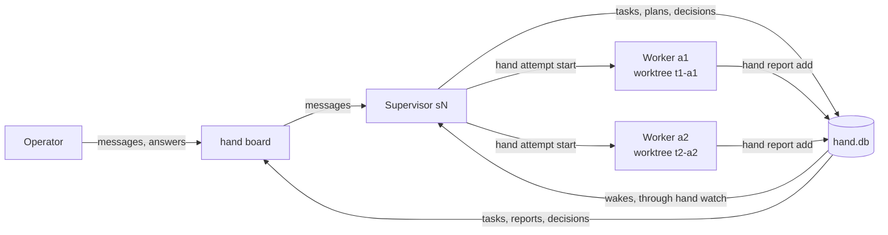

# Hand

Hand is a personal supervisor layer for coding agents. You talk to one supervisor agent. It captures every request as a task, starts Claude Code, Codex, opencode or Antigravity workers in isolated git worktrees through [Luvus](https://github.com/RizRiyz/luvus), waits for them with zero tokens, reads their reports, and asks you only through decisions. Each fleet is a folder with its own SQLite state, and one `hand board` shows every fleet.

Hand is built for one operator on Linux, not as a product for other users. The design and its non-goals are in [`docs/spec.md`](docs/spec.md), and every term used here is defined in [`docs/vocabulary.md`](docs/vocabulary.md).


```mermaid
flowchart LR
    operator["Operator"] -- "messages, answers" --> board["hand board"]
    board -- "messages" --> supervisor["Supervisor sN"]
    supervisor -- "tasks, plans, decisions" --> state[("hand.db")]
    supervisor -- "hand attempt start" --> w1["Worker a1<br/>worktree t1-a1"]
    supervisor -- "hand attempt start" --> w2["Worker a2<br/>worktree t2-a2"]
    w1 -- "hand report add" --> state
    w2 -- "hand report add" --> state
    state -- "wakes, through hand watch" --> supervisor
    state -- "tasks, reports, decisions" --> board
```

The idea of one agent running a crew of workers in worktrees is also the idea behind [firstmate](https://github.com/kunchenguid/firstmate). Hand keeps the supervisor, the fleet memory and the determinism, in one Go binary with few dependencies.

## Why

A single coding agent works well on one task. Running several at once leaves someone to:

- write each request down before work starts, so nothing lives only in chat;
- keep concurrent work in separate worktrees and branches;
- know which worker is running, blocked, quiet or finished, without watching terminals;
- keep plans, reports and decisions when a chat session ends;
- ask the operator only when a choice is theirs;
- stop and clean up workers without losing uncommitted work.

In Hand, the supervisor handles judgement and `hand` handles the mechanics. Workflow state lives in a state machine over SQLite, never in an agent's memory, so a fresh supervisor orients from `hand orient` alone. Waiting costs no tokens: a watcher wakes the supervisor only when something changed.

## Requirements

- Linux.
- git, to make worktrees. Go 1.26.5 or newer only to build Hand from source.
- Luvus, with `luvus` on `PATH` when you first run `hand init`. Hand needs its UHP 1.x protocol, and was tested with Luvus 0.14. `hand init` pins a copy of that binary under `~/.secondhand/luvus/`, so a system upgrade never changes the Luvus a fleet runs. `hand luvus pin` pins another one.
- At least one harness, logged in: Claude Code (`claude`), Codex (`codex`) or opencode 2.x (`opencode`). Run Codex once before using it, so its model cache exists. opencode uses the model from its own configuration.
- Optional: the Antigravity CLI (`agy`), logged in, so that `agy models` lists its models.
- Optional: `notify-send` for desktop notifications, `xdg-open` for `hand open`, and a systemd user session to keep the watcher, the board and Luvus running.

## Install

Install the latest release on Linux (amd64 or arm64):

```sh
curl -fsSL https://raw.githubusercontent.com/atqamz/hand/main/install.sh | sh
```

You can choose another version:
- **Edge:** `curl -fsSL https://raw.githubusercontent.com/atqamz/hand/main/install.sh | HAND_INSTALL_VERSION=edge sh`. Edge is the rolling build of `main` that passed CI.
- **A pinned release:** `HAND_INSTALL_VERSION=v0.9.0`.

`HAND_INSTALL_DIR` picks the folder; the default is `~/.local/bin`. The script checks the download against the release's `checksums.txt`, and installs nothing if it does not match.

To build from source instead:

```sh
git clone https://github.com/atqamz/hand
cd hand
go build -o ~/.local/bin/hand .
```

To try it next to an older Hand, build it under another name such as `~/.local/bin/hand-next`. Hand calls itself by its binary's name in the fleet's `AGENTS.md`, its skill, its help lines and its errors, so a supervisor in that fleet runs `hand-next`. When you later install it as plain `hand`, run that `hand init` in each fleet to rewrite them.

## Quick start

### 1. Make a fleet

```sh
mkdir -p ~/fleets/demo && cd ~/fleets/demo
hand init                                      # or: hand init --name demo DIR
```

`hand init` creates `hand.db`, writes the folder's `AGENTS.md` and `CLAUDE.md`, installs the `secondhand` skill, and writes a starter `routing.json` and `memory/operator.md`. Running it again is safe: it rewrites only the files Hand owns.

### 2. Register a project

```sh
hand project add api /absolute/path/to/api
```

A project is a name for a git repository on this machine. Hand does not clone it: each worker gets its own worktree of that repository, on its own branch.

Claude asks once to trust a folder. Trust the worktrees folder once for every fleet:

```sh
w="${SECONDHAND_HOME:-$HOME/.secondhand}/worktrees"; mkdir -p "$w" && cd "$w" && claude
```

### 3. Capture a task

The supervisor normally does this for you, but the command is the same:

```sh
hand task add --goal "sign-in redirects to /home" api "Fix the login redirect"
```

It prints the task's ref, `t1`, in the `inbox` state.

### 4. Run the watcher and the board

The watcher delivers wakes and messages to the supervisor, and the board is your interface. For a first try, run each in its own terminal, from inside the fleet folder:

```sh
hand watch
hand board
```

To keep them running, install them as systemd user units, as described in [Keep the watcher and the board running](#keep-the-watcher-and-the-board-running).

### 5. Start the supervisor and open the board

```sh
hand supervisor start --profile default
hand open
```

`hand open` opens the fleet's page and logs your browser in. You can also start the supervisor from that page instead: press **Start** and pick a routing profile, or a harness with its model and effort. The supervisor runs `hand orient` and sees `t1` in its inbox. Write your requests in the **Chat** tab.

## The daily loop

What you do:

1. Open the fleet's page with `hand open`. The **Needs you** tab lists what waits on you: open decisions, the supervisor's blocked screens, unread reports, failed, exited or interrupted attempts, and a supervisor that stopped unexpectedly.
2. Ask for work in the **Chat** tab. The supervisor captures each request as a task before doing anything else.
3. Answer decisions on their card or their page, or with `hand decision answer dN "ANSWER"`.
4. Read reports, and press **Mark read** once you have read one.
5. Follow a task on its page, or open its newest pull request with `hand open tN --pr`.

What the supervisor does, following the `secondhand` skill:

1. `hand orient`, at the start of every turn and after every wake.
2. Capture with `hand task add`, start with `hand task start tN`, and plan with `hand plan set --body-file PLAN.md tN`.
3. Start a worker with `hand attempt start --profile NAME --prompt-file BRIEF.md tN`.
4. Wait: wakes arrive as messages that start with `[hand v1 wake]`.
5. Read reports with `hand report show rN`, act on them, and acknowledge them with `hand report ack rN`.
6. Ask you with `hand decision ask tN "QUESTION"`.
7. Verify the acceptance check, then `hand attempt stop aN` if the worker still runs, `hand attempt clean aN` and `hand task done tN`.

Routing profiles live in `<home>/routing.json`, and `hand route list` shows them. The starter has `quick`, `default` and `deep`.

## Fleets

A fleet is any folder `hand init` has run in. Commands find it from `--home DIR` (given before the command), from the working directory or any folder inside it, or from `$HAND_HOME`. Run as many fleets as you like: each has its own Luvus session, worktrees and watcher, and one board serves them all. `hand fleet list` shows them.

Rename a fleet with `hand init --name NEW`. To move one, `mv` the folder and run `hand init` in its new place.

A fleet folder looks like this:

```text
~/fleets/demo/
├── AGENTS.md          Hand's; rewritten by every hand init
├── CLAUDE.md          Hand's; points to AGENTS.md
├── .claude/ .agents/ .grok/ .pi/
│                      the secondhand skill, for Claude Code, Codex, Grok and Pi
├── hand.db            the fleet's state
├── routing.json       routing profiles
├── memory/
│   ├── operator.md    your standing preferences
│   └── projects/      one file of lessons per project
└── board.token        the board's token for this fleet
```

`hand init` rewrites `AGENTS.md`, `CLAUDE.md` and the skills every time, so put your own preferences in `memory/operator.md` instead. `hand orient` shows the supervisor up to 4000 bytes of that file on every turn.

Hand keeps shared state in `~/.secondhand`, or `$SECONDHAND_HOME`. There, `fleets/` links each fleet ID to its folder, and `worktrees/` holds every worker worktree, outside every fleet:

```text
~/.secondhand/
├── fleets/<fleet id>                  link to the fleet folder
├── worktrees/<fleet id>/tN-aN/        one worktree per attempt
├── luvus/                             pinned Luvus copies and pin.json
└── board.addr                         where the running board listens
```

Each attempt works on the branch `hand/<fleet id>/tN-aN` in the project's repository. `hand attempt clean aN` removes the worktree and keeps the branch.

## Keep the watcher and the board running

Each fleet has its own watcher, so give each fleet's unit its own name. From inside the fleet folder:

```sh
name=demo
mkdir -p ~/.config/systemd/user
hand unit watch > ~/.config/systemd/user/secondhand-watch-$name.service
systemctl --user daemon-reload
systemctl --user enable --now secondhand-watch-$name
```

One board serves every fleet. Install it once, from any folder:

```sh
hand unit board > ~/.config/systemd/user/secondhand-board.service
systemctl --user daemon-reload
systemctl --user enable --now secondhand-board
```

In a systemd user session, Hand runs each fleet's Luvus server in its own user unit, `secondhand-luvus-<fleet id>`. Restarting the watcher or the board therefore never stops the agents, and `systemctl --user stop secondhand-luvus-<fleet id>` stops the server and every agent in that fleet. Without a user session, for example over plain SSH, Hand starts Luvus directly; there is no unit then, so that command does not apply.

To move from one board per fleet, stop and remove each old board unit, then install the one above:

```sh
systemctl --user disable --now secondhand-board-demo
rm ~/.config/systemd/user/secondhand-board-demo.service
```

## The board

The board listens on `127.0.0.1:7777`. Each fleet has its own page at `http://127.0.0.1:7777/<fleet id>/`, and `/` lists the fleets. Each fleet keeps its own token in `board.token` in its folder, so logging in to one fleet never logs you out of another. A fleet you add or move shows up without a restart. After a move, generate only its watcher unit again. To reach the board from a phone, use a tunnel such as `ssh -L` or `tailscale serve`.

A fleet's page has two tabs. **Needs you** lists what waits on you, then the task cards. **Chat** shows the conversation without tool calls or thinking, the message box, and the supervisor controls. Each task and each decision also has its own page. The board is a projection of Hand's state, so restarting it loses nothing, and it updates itself as things change.

`hand open` opens a page in your browser, from inside a fleet:

| Command | Opens |
|---|---|
| `hand open`, `hand open supervisor` | the fleet page |
| `hand open tN` | the task |
| `hand open dN` | the decision |
| `hand open rN`, `hand open aN` | the report or attempt, on its task's page |
| `hand open tN --pr` | the task's newest PR, on GitHub |

It logs the browser in with the fleet's token through `xdg-open` and never prints the token; `hand open --print` prints the login link instead, for a phone or another browser, so keep that output private. It finds the board through `~/.secondhand/board.addr`, which the running board writes.

The board is where you start, chat with and resume the supervisor. Those controls work only while the board listens on a loopback address, which a tunnel keeps true. On a network address such as `0.0.0.0` the supervisor controls are off; answering decisions and marking reports read still work.

## The supervisor

Hand runs the supervisor in the background in the fleet's Luvus session, in full-auto mode:

- `claude --dangerously-skip-permissions`;
- `codex --dangerously-bypass-approvals-and-sandbox`;
- `opencode --standalone --auto`;
- `agy --model ID --dangerously-skip-permissions`.

Workers run with the same flags, each in its own worktree.

agy asks once per folder whether to trust it. Every attempt is a new folder, and so is a new fleet home. Hand presses Enter on that screen only when it names the attempt's own worktree, or for the supervisor the fleet home. Otherwise it notes the attempt or the supervisor blocked. The board reads agy's conversation database for Chat and the context bar.

The fleet page updates itself as things change, and keeps what you are typing. It takes your messages, and answers the supervisor's blocked screens with a fixed set of keys.

To attach images, paste them into the message box, drop them on it, or pick them with its paperclip button. On a phone, the button opens the gallery or the camera.
- **Accepted:** png, jpeg, webp and gif, up to 10 MiB each.
- **Where they go:** each one is saved in the fleet's `inbox/` folder, and the message gets a line `[image: PATH]`. Hand never deletes `inbox/`.
- **What the supervisor sees:** the supervisor reads the image from that path.
- **In Chat:** the line shows as a thumbnail.

Attaching works over loopback only, but thumbnails also show on a network address. The live terminal stays in Luvus. `hand attach supervisor` opens it in your terminal, `hand attach aN` opens a worker's, and `hand attach` opens the whole fleet session. You never have to.

The model menu next to the message box changes the supervisor's model or effort, keeping its harness and its conversation. The switch waits for the current turn to end. opencode keeps its model in its session, so it cannot switch. The same controls exist as `hand supervisor start|send|keys|interrupt|switch|stop|resume|show`.

`hand init` writes the folder's `AGENTS.md` and `CLAUDE.md`, which make the agent run `hand orient` every turn, and the `secondhand` skill, which describes the loop above.

You can still open an agent in the fleet folder by hand (`cd ~/fleets/demo && claude`). It then waits with `hand wait --after CURSOR`, and it stands down while a managed supervisor runs.

### After a reboot

The supervisor shows as `interrupted`. Press **Resume**, or run `hand supervisor resume`, to continue the same session with its history. It spends no tokens until you write or a wake arrives. **New session** starts fresh from `hand orient`. To resume automatically when `hand watch` starts, add `"supervisor": {"autoresume": true}` to `routing.json`.

## Commands

Run `hand` with no command to list the commands, and a command with no subcommand, such as `hand attempt`, to list its subcommands. Put flags before the positional arguments; only `hand open` also takes `--pr` after the ref. `--home DIR`, given before the command, picks the fleet.

| Command | Purpose |
|---|---|
| `hand init [--name NAME] [DIR]` | Make a fleet, or refresh, rename or adopt a moved one. |
| `hand fleet list` | List the registered fleets and whether each home is found. |
| `hand project add NAME PATH`, `hand project list` | Register a repository by its absolute path, and list projects. |
| `hand task add --goal TEXT PROJECT TITLE` | Capture a request as an `inbox` task. |
| `hand task start tN`, `hand task done tN`, `hand task abandon tN` | Move a task to `active`, `done` or `abandoned`. |
| `hand task list [--status LIST] [--limit N]`, `hand task show tN` | List tasks (default `inbox,active`), or show one with its plan, attempt, report and decisions. |
| `hand plan set --body-file PATH tN`, `hand plan show tN` | Add a plan revision (or `--body TEXT`), and show the current one. |
| `hand attempt start --profile NAME --prompt-file PATH tN` | Start a worker in a new worktree; `--harness`, `--model` and `--effort` replace `--profile`, and `--base REF` picks the start point. |
| `hand attempt list [--task tN] [--limit N]`, `hand attempt show aN` | List attempts, or show one with its live agent state. |
| `hand attempt read [--lines N] aN` | Print a running worker's screen and its revision. |
| `hand attempt keys --revision N aN KEY...` | Answer a worker's screen, only if it is still at that revision. |
| `hand attempt send --text TEXT aN` | Send a worker a message (or `--file PATH`), only while it is at its prompt. |
| `hand attempt stop aN`, `hand attempt clean [--discard] aN` | Stop a worker, and remove an ended attempt's worktree while keeping its branch. |
| `hand report add --status STATUS --file -` | Report from inside a worker's worktree: `progress`, `done` or `stuck`, from stdin, a file, or `--text`. |
| `hand report list [--task tN] [--attempt aN] [--unacked]`, `hand report show rN` | List and read reports. |
| `hand report ack [--by NAME] rN` | Acknowledge a report. |
| `hand decision ask [--file PATH\|-] tN [QUESTION]` | Ask the operator about a task; the first line is the headline (at most 120 characters). |
| `hand decision answer [--by NAME] dN ANSWER`, `hand decision withdraw dN` | Answer or withdraw a decision. |
| `hand decision list [--all]`, `hand decision show dN` | List open decisions (or all), and read one with its answer. |
| `hand route list` | Show the routing profiles and the harnesses. |
| `hand luvus pin [BIN]` | Pin a copy of a Luvus binary (default: `luvus` on `PATH`) for every fleet under this `SECONDHAND_HOME`. |
| `hand luvus show` | Show the pinned Luvus and whether the fleet's running server is that copy. |
| `hand orient` | Print the bounded fleet summary the supervisor starts every turn with. |
| `hand wait [--after CURSOR] [--timeout DURATION]` | Block until a wake event arrives, for a supervisor opened by hand. |
| `hand watch [--every DURATION] [--notify=false]` | Run the fleet's watcher. |
| `hand supervisor start [--profile NAME]` | Start the managed supervisor; `--harness`, `--model` and `--effort` replace `--profile`, and with no flags it copies the last one. |
| `hand supervisor resume`, `hand supervisor stop`, `hand supervisor show` | Continue the last session, stop it, or show its state, screen revision and number of queued messages. |
| `hand supervisor send --text TEXT` | Queue a message for the supervisor (or `--file PATH`). |
| `hand supervisor keys --revision N KEY...` | Answer the supervisor's blocked screen with `enter`, `esc`, `up`, `down`, `1`, `2` or `3`. |
| `hand supervisor interrupt` | Press Escape in the supervisor's terminal. |
| `hand supervisor force` | When Luvus misreads the supervisor as blocked but its screen shows an empty Claude Code prompt, type the queued messages (or else the wakes) into it. |
| `hand supervisor switch --model M --effort E` | Switch the model or effort after this turn; or `--profile NAME`, or `--cancel`. `--harness H` switches to another harness between turns. |
| `hand board [--addr ADDR]` | Serve the board for every fleet. |
| `hand open [--print] [REF]`, `hand open tN --pr` | Open the fleet page, a task, decision, report or attempt, or a task's newest PR. `--print` prints the login link instead, for another device or browser. |
| `hand attach [supervisor]`, `hand attach aN` | Open the fleet's Luvus session, the supervisor's terminal, or a worker's. |
| `hand unit watch`, `hand unit board` | Print a systemd user unit for the watcher or the board. |
| `hand version` | Print the version, the channel (`source`, `edge` or `stable`) and the commit. |

## Upgrading from 0.7

The new Hand does not read 0.7 data. Its supervisor rebuilds what still matters, with your approval. [`docs/vocabulary.md`](docs/vocabulary.md#changed-since-07) lists the 0.7 terms that changed.

1. With 0.7 still installed, finish or `hand teardown` every live task.
2. Keep the old binary if you like, for example `cp "$(command -v hand)" ~/.local/bin/hand-0.7`.
3. Build the new one, either as `hand-next` to try it beside 0.7 or as `hand` to replace it.
4. In the fleet folder, remove the 0.7 wiring that would keep waking a supervisor: the Stop hook with `supervision claude-stop` in `.claude/settings.json`, and `.pi/extensions/hand-*` and `.opencode/plugins/hand-*`. `hand init` warns if they are still there.
5. Run `hand init` there with the new binary. The old `AGENTS.md` and skill are replaced. Everything else (`data/`, `state/`, `config/`, `projects/`) is left alone, and the folder gets a `secondhand-migrate` skill.
6. Open the supervisor there and ask it to migrate the fleet. It lists what it would create (projects, open tasks, queue items, decisions, routing and memory), then waits for your approval before it changes anything.
7. Afterwards it can remove the 0.7 pool worktrees and shared files, and then archive the old data into `legacy-0.7/`. Each of those steps waits for your approval. Its last step runs `hand init`, which removes the migrate skill.
8. Trust the worktrees folder once, as described in [Register a project](#2-register-a-project).

## Development

Read [`AGENTS.md`](AGENTS.md) and [`docs/spec.md`](docs/spec.md) before changing anything. The only dependency is `modernc.org/sqlite`. Before committing, run:

```sh
gofmt -l .
go vet ./...
go test -race ./...
```

The tests set `SECONDHAND_HOME` to a temporary folder and never touch the real one.

## License

MIT
