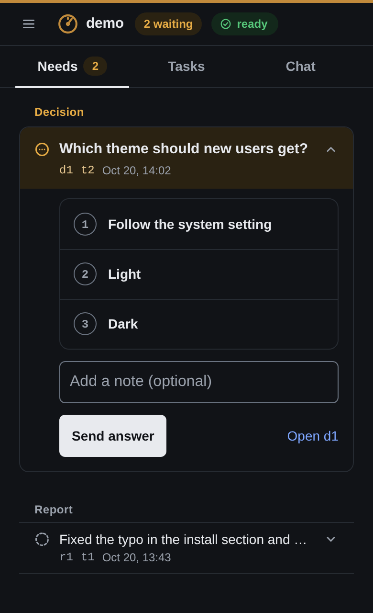

# Hand

Hand is a personal supervisor layer for agents. You talk to one supervisor agent. It captures every request as a task, starts Claude Code, Codex, opencode or Antigravity workers in isolated git worktrees through [Luvus](https://github.com/RizRiyz/luvus), waits for them with zero tokens, reads their reports, and asks you only through decisions. Each fleet is a folder with its own SQLite state, and one `hand board` shows every fleet.




## Platform support

Hand is built for one operator, who runs it every day on Linux. macOS (Apple silicon) and native Windows (amd64) are supported best effort, with no timeline for fixes: CI runs the tests on both, one real Mac has run a fleet with a stand-in `claude`, and no real Windows machine has run one yet, so they rely on your reports. [`docs/platforms.md`](docs/platforms.md) says how each part is verified.

## Install

You need git and at least one harness, logged in: Claude Code (`claude`), Codex (`codex`) or opencode (`opencode`). `hand init` downloads the tested Luvus when none is on `PATH`. [Requirements](docs/install.md#requirements) has the rest.

On Linux or macOS:

```sh
curl -fsSL https://raw.githubusercontent.com/atqamz/hand/main/install.sh | sh
```

On Windows, in PowerShell, then open a new terminal; [Windows](docs/install.md#windows) has two settings to make once:

```powershell
irm https://raw.githubusercontent.com/atqamz/hand/main/install.ps1 | iex
```

For the rolling `edge` build of `main`, or a pinned release such as `v0.12.0`, set `HAND_INSTALL_VERSION` first: `curl -fsSL https://raw.githubusercontent.com/atqamz/hand/main/install.sh | HAND_INSTALL_VERSION=edge sh`, or `$env:HAND_INSTALL_VERSION = 'edge'` before the PowerShell line. To update, run `hand update`. Releases after v0.11.0 and the edge build also get a build attestation, best effort: `gh attestation verify hand-linux-amd64.tar.gz --repo atqamz/hand` checks who built a download.

[`docs/install.md`](docs/install.md) has every install option and building from source. [`docs/update.md`](docs/update.md) says what `hand update` does and how to restore a backup.

## Safe use

Read this before you start a supervisor:

- **No sandbox.** Every worker runs as your own OS user, in a git worktree that is not a fence. It can read whatever your account can: `~/.ssh`, `~/.config/gh`, `~/.gnupg`, other fleets and each fleet's `board.token`.
- **Prompts skipped.** The supervisor and every worker run with their permission prompts skipped, such as `claude --dangerously-skip-permissions`, so ordinary commands run without a prompt. Claude Code still asks before it removes a critical path such as your home folder, and denies after two minutes.
- **What that means.** A worker that obeys text planted in an issue, a PR or a review can use all of that access. Run Hand as a dedicated OS user or in a VM, with a narrow GitHub token and a protected default branch. [`docs/safe-use.md`](docs/safe-use.md) has the exact flags, the steps ranked by value, and what no setup prevents.

## Getting started

You use two commands, then the browser. The other `hand` commands are for the supervisor, the agent that runs your fleet.

1. **Make a fleet.** In a folder of its own:

   ```sh
   mkdir -p ~/fleets/demo && cd ~/fleets/demo
   hand init
   ```

   This writes `hand.db`, the folder's `AGENTS.md` and `CLAUDE.md`, the `secondhand` skill, a starter `routing.json` and `memory/operator.md`, registers the folder under `~/.secondhand`, and pins Luvus, downloading the tested version when none is on `PATH`. It starts nothing. Running it again is safe.
2. **Open it.** `hand open` opens the fleet's page in your browser and logs you in. `hand open --print` prints the login link for another browser or a phone; keep it private, since it holds the fleet's token. When no board answers, `hand open` starts one first ([Keep the watcher and the board running](docs/autostart.md#keep-the-watcher-and-the-board-running)).
3. **Work in the browser.** A new fleet has no supervisor yet: press **Start** and pick a routing profile (`default` is a good first one). That starts the supervisor in the fleet's Luvus session and its watcher. Then:
   - write to the supervisor in the **Chat** tab, and name the repositories it should work on by absolute path. A first message could be: *Register /abs/path/to/repo as project demo, add a task to fix a typo in its README, and start a quick worker.*
   - answer its decisions under **Needs**;
   - read its reports, and press **Mark read**.

The other commands (`hand task`, `hand attempt`, `hand decision`, `hand report`, `hand orient`, `hand wait` and the rest) are what the supervisor and its workers run. You rarely need them, and the [command table](docs/commands.md) is a reference.

## Autostart

One autostart is enough: run `hand board` once at login, and the board starts every fleet's watcher that needs one. On Linux that is the systemd user unit `hand unit board` prints, on macOS a LaunchAgent, and on Windows a shortcut in the Startup folder. [`docs/autostart.md`](docs/autostart.md) has each recipe, and how to remove the per-fleet watch units of earlier versions.

## If something does not work

Run `hand doctor` in the fleet folder. It checks Hand, git, the harnesses and routing profiles, Luvus, the fleet, each project's git settings, the board, the phone address and the watcher, and prints a fix for each problem. It repairs nothing and spends no tokens, so paste its output into a bug report. The board finds `claude` and the other harnesses on the `PATH` it started with, which can differ from your shell's: restart the board after you install one with `hand board stop` and `hand board`, or restart its unit (a systemd unit keeps the `PATH` from when you ran `hand unit board`, see [Linux](docs/autostart.md#linux)).

Report a problem with the [bug form](https://github.com/atqamz/hand/issues/new?template=bug.yml), and a vulnerability as [`SECURITY.md`](SECURITY.md) says.

## Testing on macOS or Windows

If you have a Mac or a Windows machine, you can help by running the checks in [`docs/dogfood/`](docs/dogfood/README.md), yourself or with a coding agent: they use a throw-away home that never touches your own fleets, and each failure becomes an issue. A passing run moves a row of the [platform table](docs/platforms.md) from "CI" to a real-machine result.

## Documentation

- [How Hand works](docs/how-it-works.md): why it exists, the flow from you to the supervisor and its workers, and the daily loop.
- [Install](docs/install.md): requirements, install options, Windows notes and building from source.
- [Update](docs/update.md): what `hand update` does, how it switches Luvus, how to restore a backup, and updating on a timer.
- [Platform support](docs/platforms.md): how each part is verified on Linux, macOS and Windows.
- [Fleets](docs/fleets.md): where Hand finds a fleet, and what its folder and `~/.secondhand` hold.
- [Autostart](docs/autostart.md): how the watcher and the board keep running, and how to start the board at login.
- [The board](docs/board.md): the fleet page, `hand open` and reaching the board from a phone.
- [Reach the board from a phone without Tailscale](docs/phone.md): an SSH tunnel, Cloudflare Tunnel with Access, WireGuard and a LAN address, with what each exposes.
- [The supervisor](docs/supervisor.md): its harness flags, trust screens, attachments, reboots, idle wakes and timers.
- [Alerts on your phone](docs/alerts.md): send every alert to your own command.
- [Clean the inbox](docs/inbox.md): prune old attachments.
- [Safe use](docs/safe-use.md): what the agents can do with prompts skipped, how to run Hand safer, and what nothing prevents yet.
- [Commands](docs/commands.md): every `hand` command.
- [Upgrading from 0.7](docs/upgrade-from-0.7.md).
- [Design and non-goals](docs/spec.md) and [vocabulary](docs/vocabulary.md).

## Development

Read [`AGENTS.md`](AGENTS.md) and [`docs/spec.md`](docs/spec.md) before changing anything. The dependencies are `modernc.org/sqlite`, and `golang.org/x/sys` for macOS process start times. Before committing, run:

```sh
gofmt -l .
go vet ./...
go test -race ./...
```

The tests set `SECONDHAND_HOME` to a temporary folder and never touch the real one.

On Windows, `.gitattributes` keeps text files LF whatever `core.autocrlf` says, and a short `TEMP` (for example `D:\ht`) keeps paths short. A few tests need `sleep` on `PATH` (Git for Windows' `usr\bin`) or the privilege to create symlinks (Developer Mode), and fail without them. Without a C compiler, `go test -race` cannot run.

## License

MIT
